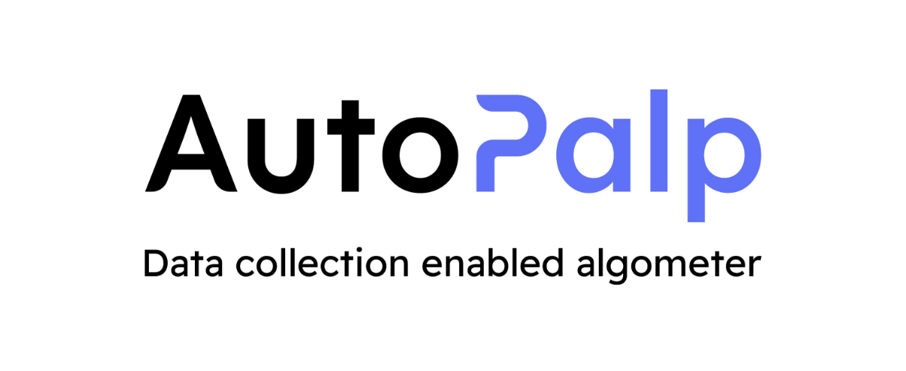
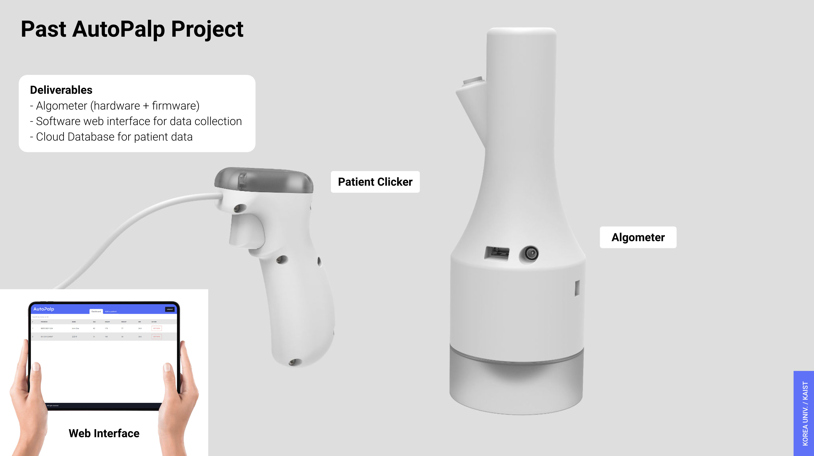
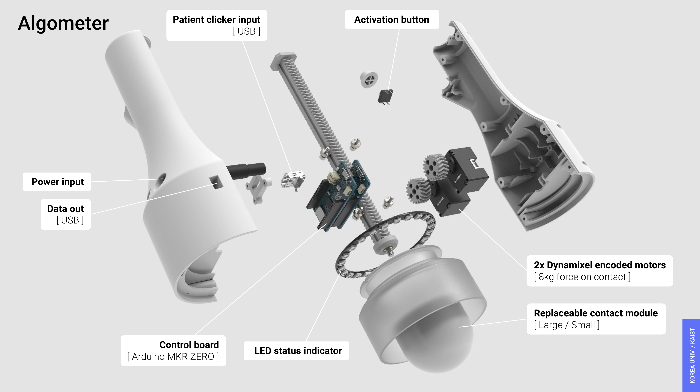
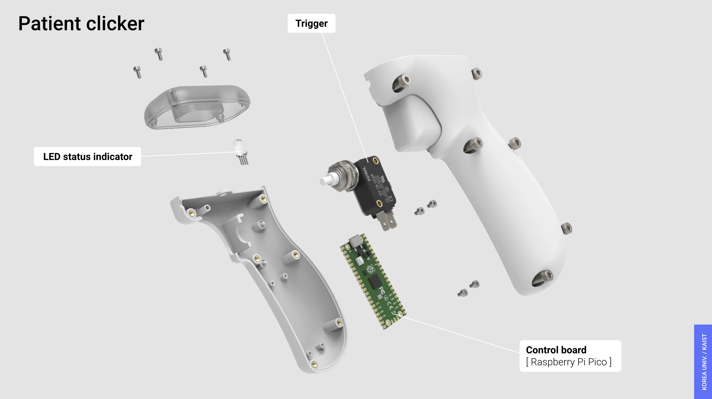

    

---

## Device Demo

[[Youtube](https://youtu.be/FSd1KUu1d40?si=FxYpzbRAUv_d467h)]

## Hardware

## System Architecture

## License

AutoPalp is developed by joint collaboration between [Korea University College of Medicine](https://medicine.korea.ac.kr/en/index.do) and [KAIST Make Lab](https://make.kaist.ac.kr/).