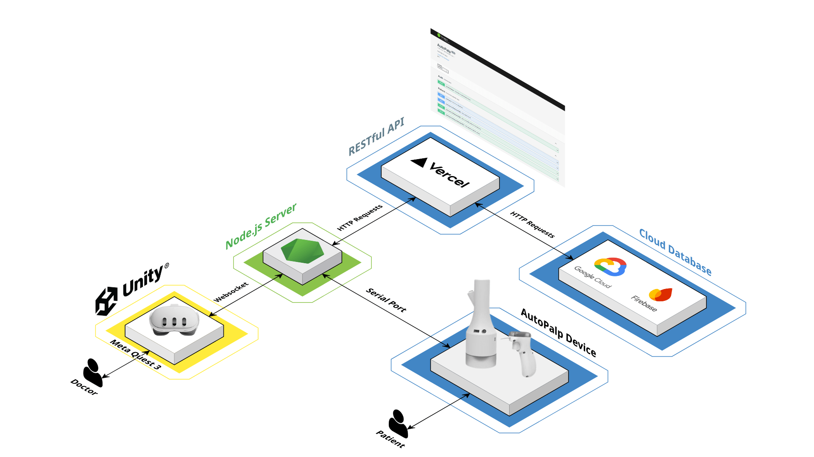

<p align="center">
    
</p>

---

## Device Demo

[[Youtube](https://youtu.be/FSd1KUu1d40?si=FxYpzbRAUv_d467h)]

<a href="https://youtu.be/FSd1KUu1d40?si=FxYpzbRAUv_d467h">
    
</a>

## Hardware


## System Architecture



## Code Structure

```code
Assets
├── Abdomen Interface
│   └── interface.fbx
├── Audio
│   ├── AdjustSize.mp3
│   ├── Finish.mp3
│   ├── Palpation.mp3
│   └── TurnOn.mp3
├── Hand Gesture
│   ├── AutoPalp Grab Hand Pose.asset
│   └── AutoPalp Grab Hand Shape.asset
├── Images
│   └── VAS.png
├── Materials
│   ├── Abdomen.mat
│   ├── Black.mat
│   ├── Default White.mat
│   ├── Nine Region Blue.mat
│   ├── Nine Region White.mat
│   └── Transparent.mat
├── Scenes
│   └── MainScene.unity
└── Scripts
    ├── AbdomenUISizeController.cs
    ├── AbdominalRegionLineDrawer.cs
    ├── AutoPalpResetManager.cs
    ├── GameObjectToggler.cs
    ├── PainScaleDisplay.cs
    ├── PalpationCompletionHandler.cs
    ├── PalpationSequenceManager.cs
    └── SliderValueResetter.cs

```

## License

AutoPalp is developed by joint collaboration between [Korea University College of Medicine](https://medicine.korea.ac.kr/en/index.do) and [KAIST Make Lab](https://make.kaist.ac.kr/).

## Contact

For questions please contact jungym887@gmail.com.